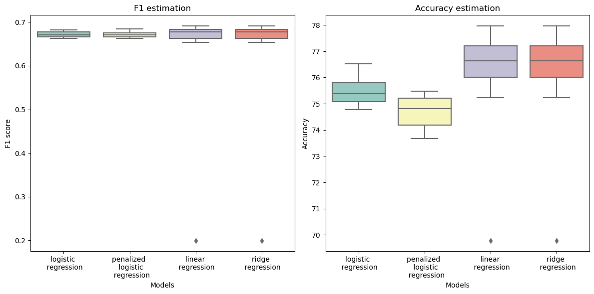

[](https://classroom.github.com/a/U9FTc9i_)


# Introduction <a name="intro"></a>

This Python project utilizes machine learning algorithms to predict Cardiovascular Diseases (CVD) based on lifestyle factors and clinical data. The [dataset](https://www.cdc.gov/brfss/annual_data/annual_2015.html), sourced from the Behavioral Risk Factor Surveillance System (BRFSS), provides information about health-related behaviors and chronic conditions of U.S. residents.

The goal is to build a binary classification model that estimates the risk of developing CVD, offering early detection and prevention solutions. 

## Project Architecture
```
project
│   README.md
|   report.pdf
│   project1_description.pdf
│   Project1_Report_epfaliens.pdf
│
└───model_performance
│       logistic_regression_performance.pkl
│        ridge_regression_performance.pkl
│        model_parameters.npy
|
└───Visualization
│        data_analysis.ipynb
│        models_performance.ipynb
|
└───python scripts: 
        run.py                          # Use all the implmented functions and create the submissions.csv file
        preprocess_data.py              # functions for data preprocess
        implementations.py              # model implementations
        cost.py                         # functions related to model performance evaluation:
        cross_validation.py              # functions for cross validation 
        helpers.py                       # functions for data loading and submission creation.
        utils.py                        # helper function of model implementations
        data_analysis.ipynb             # Jupyter Notebook for data processing and Model evaluation
   
```

## Usage

To run the program, execute the following command:

```bash
python run.py
```

Running this command will execute the main program that loads the data, preprocesses it, and uses the machine learning algorithms explained so far to make predictions. The predicted results are then stored in a CSV file "submission1.csv". For more information on the project's architecture and how each module contributes to the workflow, please refer to section 6 project  the documentation within each module. 


## Data Preprocessing
-  `Remove Columns with High NaN Percentage ` :In the first step, we identify columns within the dataset that contain a substantial proportion of missing data, ("NaN" values). We remove such columns as they may not provide sufficient information to contribute meaningfully to our machine learning models.

- `Replace NaN Values with Column Mean`: When dealing with missing data, we opt to replace NaN  values with the mean value of the respective column. This technique ensures that incomplete data entries do not disrupt the analysis and we maintain the dataset's statistical properties.

- `Remove Columns with Null Standard Deviation`: Columns exhibiting a null standard deviation, indicating constant values, are eliminated from the dataset. Removing them helps in simplifying the dataset and preventing potential overfitting issues.

- `Standardize Values`: To ensure consistency and enhance model performance, we standardize the values within our dataset. Standardization involves scaling the data so that it has a mean of 0 and a standard deviation of 1. This process helps in reducing the impact of variables with different scales,.

- `Outliers Removal from the Training Set`: In this step, we identify and remove outliers from the training set. Outliers, extreme values that deviate significantly from the majority of the data, can negatively impact model performance. 

- `Replace -1 Class with 0`: To ensure the compatibility of our classification models, we replace class labels represented as -1 with 0. This transformation facilitates the use of sigmoid and log operations within the machine learning algorithms, ensuring that our models perform as expected and produce accurate results.

- `Balance Data`: As discussed before, the data is unbalanced. Addressing class imbalanceis essential for the effective training of machine learning models. The new balanced dataset prevents the model from being biased toward the majority class and enhances its predictive performance.

## 4) Machine Learning Models

- `Initialization`: We Initialize the hyperparameters grid over which we will train our model and the initial value of weights before starting the optimization algorithm. We will perform our regression using three different techniques : logistic regression and ridge regression.

- `Compute the loss`: Compute the loss over the training dataset using the current weights and the hyperparameters of the models.

- `Update weights`: At each step of the optimization algorithm, we compute the gradient of the loss and then update the values of the weights w according to the regression method chosen.

## 5) Model Evaluation

-`Perform a cross validation`: Perform a cross validation over the weights obtained for each combination of the hyperparameters grid. Then save the best one for each regression techniques according to the F1-score metric and then the accuracy.

-`Choose and save the best method and hyperparameters`: Compare the results of the cross validation to choose the best regression technique and save the hyperparameters which and weights which will be used in the forecasting.

-`Predictions over the testing dataset`: Generate predictions for the testing dataset using the linear regression models and save the prediction results to a CSV file named 'submission1.csv'.

## 6) Results
In our analysis, we use a 10-fold cross-validation on the dataset. We record the F1 scores and accuracies for each iteration. The resulting table and the box plot below illustrate the distribution of these performance metrics for the implemented models with their optimal hyperparameters.
| Methods                                                  | accuracy | F1-score |
|----------------------------------------------------------|----------|----------|
| Linear Regression using Stochastic Gradient Descent      | 76.02    | 0.628    |
| Ridge Linear Regression using Stochastic Gradient Descent | 76.98    | 0.647    |
| Logistic Regression using Stochastic Gradient Descent    | 75.27    | 0.672    |
| Penalized Logistic Regression using Stochastic Gradient Descent | 74.7 | 0.671    |




It is evident that the median F1 scores and accuracies of linear/ridge regression slightly outperform the logistic regression model. However, it's worth noting that there are outliers within a certain interval for linear/ridge regression, whereas the logistic regression model displays a smaller box and reduced variance, indicating greater stability.
